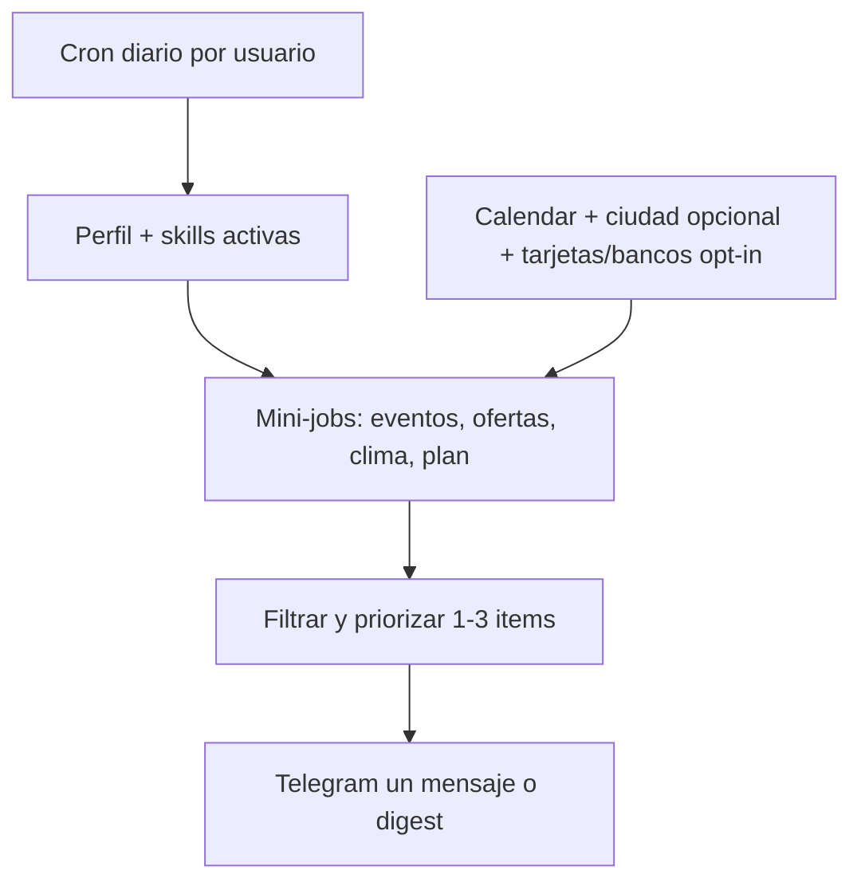

# Backlog & registro de decisiones — Animus

Documento vivo: cada charla, pregunta y decisión se vuelca acá para después sacar un **extracto general** (prioridades, features, qué descartar).

**Cómo usarlo**
- **Decisiones:** cosas cerradas (no reabrir sin motivo).
- **Ideas / después:** candidatos a implementar, sin compromiso de fecha.
- **Preguntas abiertas:** pendientes de respuesta tuya.
- **Descartado MVP:** fuera de scope actual (puede volver post-validación).

*Última actualización: 2026-05-19 (memory bank + gastos + plan_dia)*

---

## Decisiones tomadas

| Fecha | Tema | Decisión |
|-------|------|----------|
| 2026-05-18 | Canal | **Telegram primero** (no app RN en MVP) |
| 2026-05-18 | Usuarios Alpha | **Vos + tu hermana** — 2 perfiles separados (`telegram_user_id`) |
| 2026-05-18 | Obsidian | **Fuera del MVP** — memoria en Supabase + chat |
| 2026-05-18 | Arquitectura IA | **Orquestador único + skills**, no multi-agente autónomo |
| 2026-05-18 | Activación features | **Skills progresivas** con consentimiento (Nivel 0 → 1 → 2) |
| 2026-05-18 | Intrusión | **Día 1 cero proactivos**; avisos solo con skill + “avisos” activos |
| 2026-05-18 | Alcance MVP | **Catálogo completo en visión**, implementación por semanas; no MVP “chico” en sueño |
| 2026-05-18 | Inspiración | Modelo tipo [Meta Second Brain](https://medium.com/@AnalyticsAtMeta/how-we-built-an-ai-second-brain-for-60k-knowledge-workers-78c507dd795b), versión **personal** LATAM |
| 2026-05-18 | Stack | Next.js 15 (API = backend) + Vercel + Supabase + Telegram + OpenAI |
| 2026-05-18 | Accesibilidad | Reglas universales (mensajes cortos, Sí/No, quiet hours) — aplican ya en Telegram |
| 2026-05-19 | Sin GPS | **Plan del día por calendario + preguntas**; ubicación opcional, no requerida |
| 2026-05-19 | Fase 2 | **Agentes que corren todos los días** → “noticias” personalizadas por persona (eventos, ofertas, contexto) — no en MVP inicial |

---

## Fase 2 — Agentes diarios + “noticias” personalizadas

**Visión:** como corre el mundo ahora (agentes/jobs cada día), pero **por usuario** y según **quién es** la persona: un digest proactivo de lo relevante, no spam genérico.

### Cómo funcionaría



1. **Cada mañana** (o ventana que elija): corre un **pipeline de agentes** (tareas acotadas, no chat libre).
2. Cada agente mira **fuentes** según lo que la persona activó y su perfil.
3. Se **cruza** con el plan del día / calendario / ciudad (si la compartió).
4. Sale **1–3 “noticias” útiles**, no un muro.

### Ejemplos de “noticias” (según la persona)

| Señal | Ejemplo de mensaje |
|-------|-------------------|
| Ciudad / zona (pin o perfil) | “Hoy en Palermo: feria X y recital Y” |
| Calendario libre 19–22 | “Tenés la noche libre — este evento arranca a las 20 cerca” |
| Perfil: le gusta X, tarjeta Z | “Hoy 30% en [bar] pagando con [tarjeta]” (solo si skill `ofertas` activa) |
| Día de semana + hábitos | “Los martes sueles ir al gym — ¿sigue en pie?” (plan_dia, no ubicación) |
| Finanzas | “Cerró el 2x1 en super que mencionaste la semana pasada” (si hay fuente confiable) |

### Skills Fase 2 (candidatas)

| Skill | Qué hace | Consentimiento |
|-------|----------|----------------|
| `noticias_dia` | Digest matutino personalizado | Opt-in Nivel 2 + tope 1 digest/día |
| `eventos_local` | Eventos en ciudad/zona | Ciudad en perfil o pin ocasional |
| `ofertas` | Descuentos tarjeta/día/bar | **Explícito:** “¿Qué tarjetas usás?” — sin esto no inventar ofertas |
| `ubicacion` | Mejorar eventos “cerca” | Opcional; plan_dia alcanza sin esto |

### Técnico (cuando llegue Fase 2)

- Vercel Cron **por usuario** o cola (Inngest / Trigger.dev si escala) — no un solo cron global ingenuo.
- Tabla `daily_runs` + `digest_items` (qué se envió, feedback Sí/No).
- Fuentes externas: APIs eventos (Eventbrite, local), ofertas — **riesgo legal/hallucination** → solo datos verificados o “te paso link, confirmá”.
- Mismo orquestador; “agentes” = **handlers programados** + LLM para redactar, no enjambre autónomo.
- Límite: máx. N noticias/día; “Parar hoy” / pausar skill `noticias_dia`.

### Fases resumidas

| Fase | Enfoque |
|------|---------|
| **1 (ahora)** | Telegram, memoria, plan_dia, gastos, reuniones, heladera — **sin** digest de ofertas/eventos masivo |
| **2** | Agentes diarios + noticias personalizadas (eventos, ofertas, contexto local) |
| **3** | WhatsApp, más fuentes, posible app |

---

## En construcción (MVP actual)

- [x] Scaffold Next.js + webhook Telegram + health + cron stub
- [x] Memory bank (facts, entities, relations) + retrieve + `/mind`
- [x] Extractor post-mensaje (throttle 30s) + `olvidá X`
- [x] Skill `gastos` + confirmación Sí/No (inline)
- [x] Skill `plan_dia` básica + “Mis skills” con DB
- [ ] Conectar `.env` y deploy (ver `docs/SETUP.md`)
- [x] Google Calendar OAuth + skill `reuniones` (`/connect google`, `/agenda`)
- [x] Clima wttr.in + toolset web + `/integrations` + modo Hermes
- [x] WhatsApp webhook stub + Spotify OAuth stub
- [ ] Groq voice + OpenAI TTS (toolset Hermes tts)
- [ ] Vision + skill `nutricion`
- [ ] Skill `wrapup` + proactividad Nivel 2 por skill

---

## Ideas para después (extracto futuro)

### Plan del día (sin ubicación — alternativa principal)
- [ ] Skill **`plan_dia`** (o extensión de `wrapup`): mañana pregunta “¿qué tenés hoy?” + lee Google Calendar
- [ ] Cruce: eventos del calendario + respuesta libre → resumen corto del día (“a las 15 call, a la noche gym”)
- [ ] Guardar `day_plan` en DB (fecha, items, source: calendar | user | bot)
- [ ] **Día siguiente:** “¿Cambió algo respecto de ayer?” → merge / actualizar plan
- [ ] Sin ubicación obligatoria; ubicación solo opt-in si algún día la quieren
- [ ] Proactividad Nivel 2 opcional: un solo mensaje matutino (“¿Armamos el día?”) solo si activan skill

### Producto
- [ ] Más usuarios (amigos) tras 2 semanas vos + hermana
- [ ] WhatsApp Business API (cuando LTV lo justifique)
- [ ] App Expo (si Telegram no alcanza para 60+ o UX)
- [ ] Modo familiar: helper vincula Calendar por otra persona
- [ ] Tour guiado 10 min (“ver todo” sin activar spam)
- [ ] TTS: “Escuchá el resumen” en reuniones / wrap-up
- [ ] Export perfil (“Qué sabés de mí”) en lenguaje llano

### Ubicación (skill candidata `ubicacion`)
- [ ] **Telegram — pin puntual:** usuario manda ubicación → guardar lat/lon + timestamp → clima, “¿seguís en X?”
- [ ] **Telegram — ubicación en vivo:** mientras comparte live location, el bot recibe updates → calcular permanencia en radio (ej. gym 45 min)
- [ ] Tabla `location_events` (user_id, lat, lon, accuracy, started_at, ended_at, place_label?)
- [ ] Preguntas: “¿cuánto estuviste en el gym?”, “¿saliste de casa?” — solo con historial + consentimiento explícito
- [ ] **No en MVP inicial:** tracking pasivo 24/7 sin app nativa (Telegram no da GPS de fondo)
- [ ] Post-MVP: app Expo con permiso “siempre” o integración Google Timeline (complejo + privacidad)

### Integraciones
- [ ] **Obsidian** — import vault + espejo escritura (post-MVP, descartado por ahora)
- [ ] OpenWeather en mensajes proactivos (`contexto_vida`) — mejora si hay lat reciente
- [ ] Claude como provider alternativo (intercambiable con OpenAI)
- [ ] pgvector / RAG si el perfil crece mucho

### Skills (catálogo Meta-style)
- [ ] `/read-meeting-notes` automático diario (como Meta)
- [ ] Día de cobro + presupuestos (finanzas proactivas)
- [ ] Skills custom en markdown (comunidad / vos)
- [ ] “Third brain” equipo (muy post-MVP)

### Benchmark técnico: [Hermes Agent](https://github.com/nousresearch/hermes-agent)
- [x] Agent loop + tools — `lib/agent/`, `AGENT_TOOLS_ENABLED`
- [x] Memory + session_search + runtime skills — ver [docs/HERMES-PATTERNS.md](./docs/HERMES-PATTERNS.md)
- [x] Fase 2: curator + SKILL.md + nudge post-tarea
- [ ] Fase 3: MCP · Fase 4: multi-gateway · Fase 5: subagentes

### Negocio / competencia
- [ ] Revisar mercado LATAM cuando definamos pricing
- [ ] Tier Free/Pro (Vision limits, proactividad ilimitada)

---

## Preguntas que surgieron (y respuesta si hay)

| Pregunta | Respuesta / estado |
|----------|-------------------|
| ¿Telegram o React Native? | Telegram MVP; RN después si hace falta |
| ¿Skills o agentes? | Skills orquestadas; no multi-agente en Alpha |
| ¿Obsidian al inicio? | No en MVP; posible después |
| ¿Referencia técnica? | Hermes Agent (arquitectura); foso producto = LATAM + no-intrusivo + consumidor |
| ¿Next solo front? | **No** — Next = backend (API Routes) + `lib/` |
| ¿Guardar preguntas para extracto? | **Sí** — este archivo `BACKLOG.md` |
| ¿Ubicación / cuánto tiempo en un lugar? | **Parcial en Telegram** (pin o live location + opt-in); tracking continuo = app después |

---

## Preguntas abiertas

- [ ] ¿Timezone fijo AR o configurable por usuaria?
- [ ] ¿Moneda default ARS para vos y hermana?
- [ ] ¿Proveedor LLM principal: OpenAI vs Claude desde día 1?
- [ ] ¿Nombre público del bot en BotFather?

---

## Descartado / no ahora

| Item | Motivo |
|------|--------|
| Obsidian en MVP | Foco en Telegram + Supabase; menos fricción |
| Multi-agente | Complejidad; orquestador alcanza |
| Redis / vector DB día 1 | 2 usuarios; perfil JSON alcanza |
| WhatsApp | Costo + templates; Telegram para validar |

---

## Notas de sesión (cronológico)

### 2026-05-19 — Ubicación
- **Pregunta:** ¿acceder a ubicación para saber cuánto tiempo estuvo en cada lugar y hacer preguntas?
- **Respuesta técnica:** Con solo Telegram no hay GPS de fondo; sí pin + ubicación en vivo compartida. Skill `ubicacion` con consentimiento fuerte; historial en DB para duración y preguntas.
- **Acción:** backlog (después de gastos/reuniones); no bloquea MVP actual.

### 2026-05-19 — Arquitectura Hermes
- **Decisión:** Filosofía Hermes en TypeScript (agent loop, toolsets, procedural memory), no fork Python.
- **Hecho:** `lib/agent/`, `lib/skills/registry`, memory, `docs/HERMES-PATTERNS.md`.

### 2026-05-19 — Fase 2 agentes diarios + noticias
- **Idea:** Correr agentes todos los días (como el modelo actual de la industria); según **quién es** la persona, mandar noticias útiles: eventos en su zona, “hoy está barato en X con tarjeta Y”, cruzado con el día.
- **Decisión:** **Fase 2**, no MVP. Fase 1 = plan_dia + calendar + preguntas. Ofertas/eventos requieren skills opt-in y fuentes fiables.
- **Acción:** backlog Fase 2; diseño `noticias_dia`, `eventos_local`, `ofertas`.

### 2026-05-19 — Plan del día sin ubicación
- **Idea:** Si no comparte ubicación (ni datos sensibles), el bot usa **calendario + preguntas** (“¿qué hacés hoy?”) → arma plan del día → al día siguiente repregunta si cambió y ajusta.
- **Encaja con:** no intrusivo, skill `reuniones` + `wrapup`, memoria en perfil (`dated_plans`), sin GPS.
- **Acción:** diseñar skill `plan_dia` (o parte de `wrapup` + calendar); prioridad MVP media-alta.

### 2026-05-19 — Rebranding
- **Decisión:** Producto renombrado a **Animus**. Repo: https://github.com/ticoxz/Animus

### 2026-05-18
- Análisis `mvp.md`: visión Animus (compañero proactivo), 3 módulos, memoria en Supabase.
- Accesibilidad universal (abuelos): mensajes cortos, Sí/No, quiet hours desde Fase 1.
- Validación: primero vos, después hermana; “god” en capacidades, suave en intrusión.
- Referencia arquitectura: Hermes Agent; producto: Meta Second Brain playbook.
- Código: scaffold repo Next + webhook + schema SQL.

---

## Plantilla para nuevas entradas

Copiar debajo cuando haya charla nueva:

```markdown
### YYYY-MM-DD — [título corto]
- **Pregunta:**
- **Decisión / idea:**
- **Acción:** (implementar | backlog | descartar)
```
